**Скріни до виконання лабораторної роботи №2**

**1. Виведення змінних середовища (браузер і консоль)**
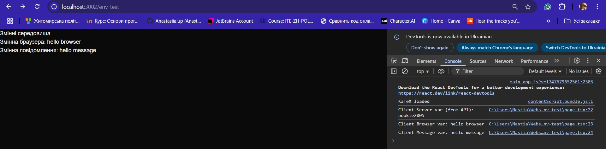

**2. Логи до бази даних**
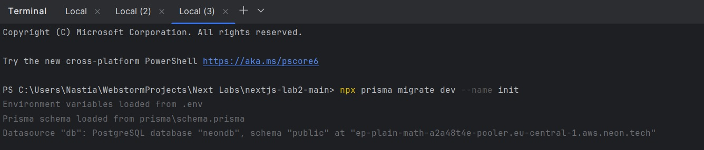
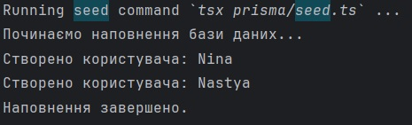

**3. Результати з dev з бд Неон**
**3. Друга картинка мала бути сідом, але я ненароком видалила тут консоль і не заскрінила, а на другий раз воно вже помилку пишу, бо сід вже заповнений**
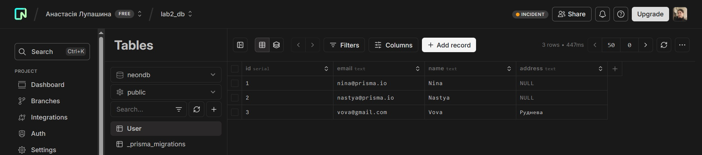
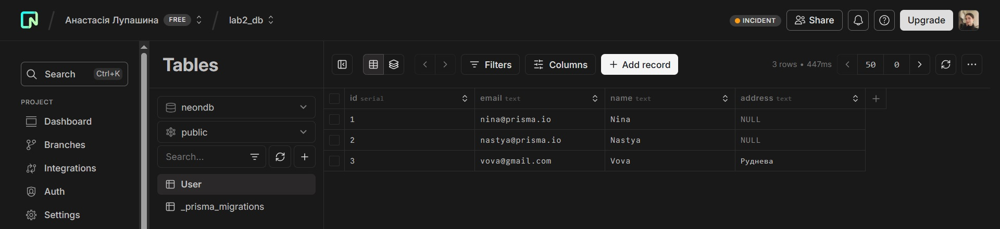

**4. Результати CRUD з фронтенду**

**get**
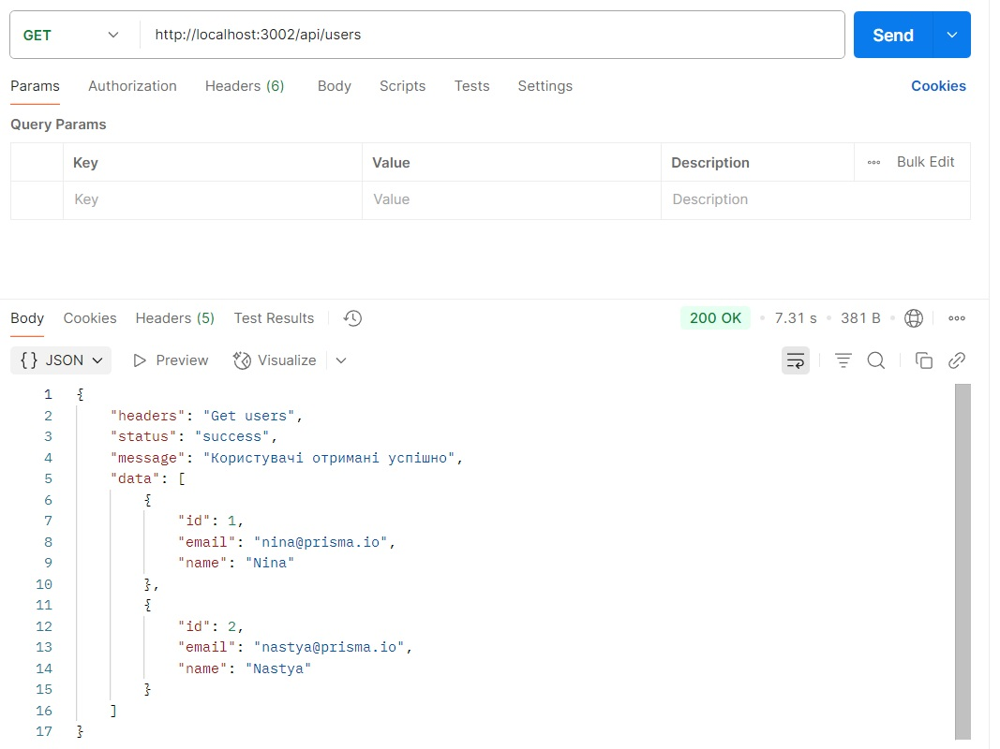

**create**
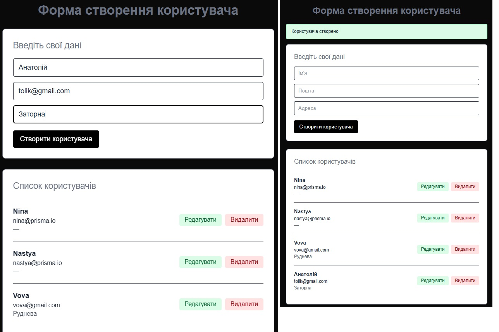

**edit**
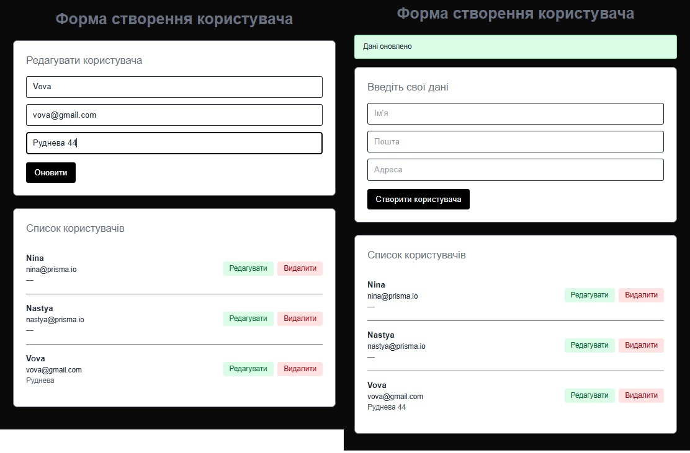

**delete**
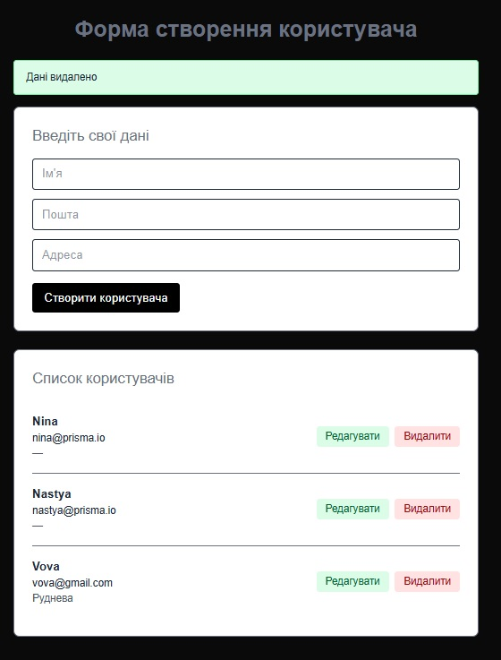

**5. Результати CRUD з postman**

**get**
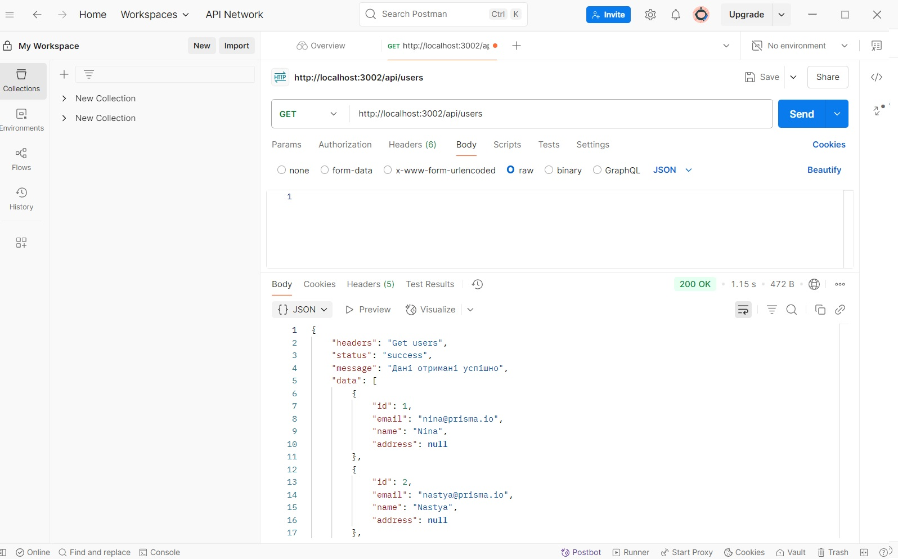

**create**
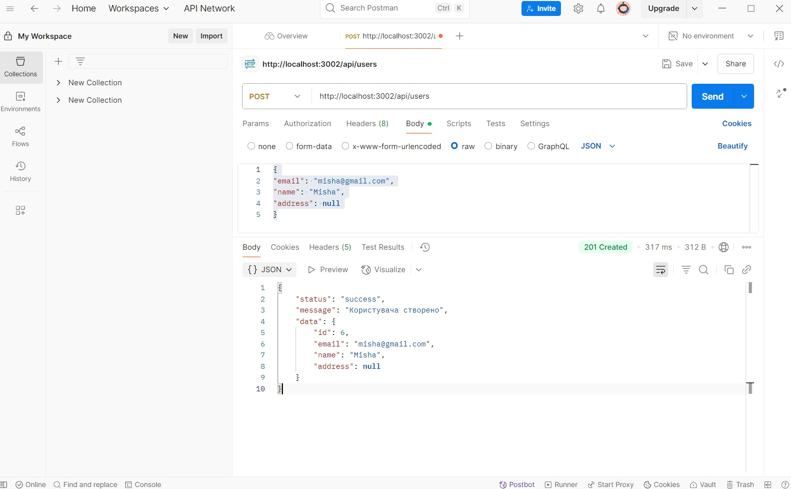

**edit**
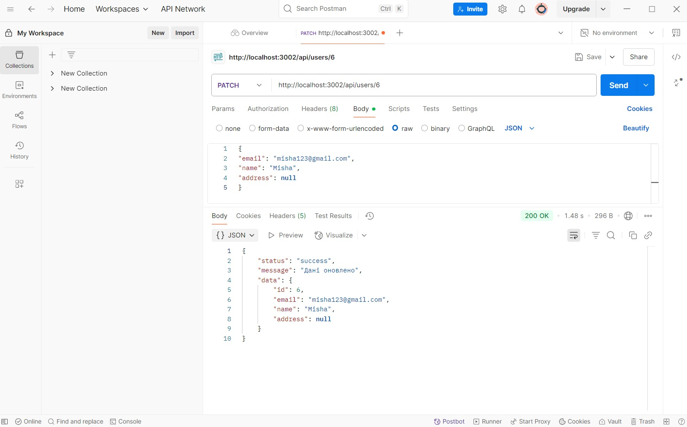

**delete**
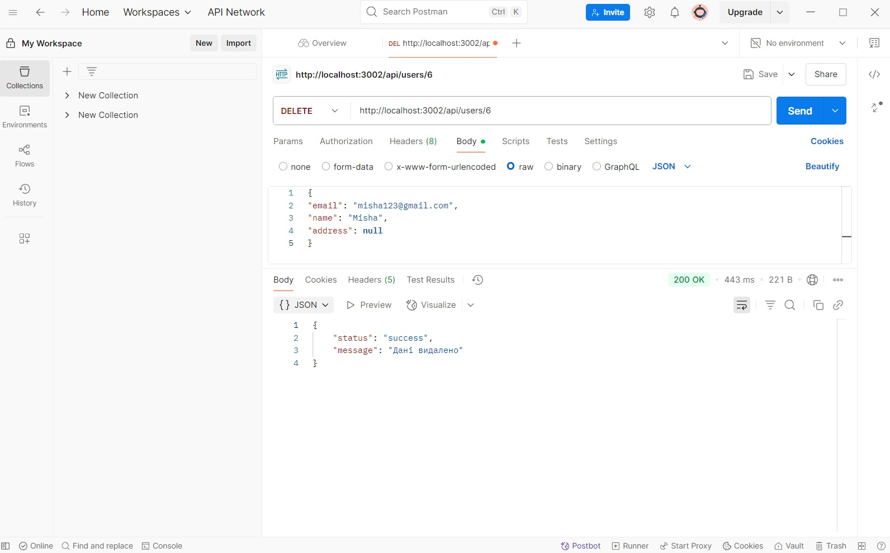 